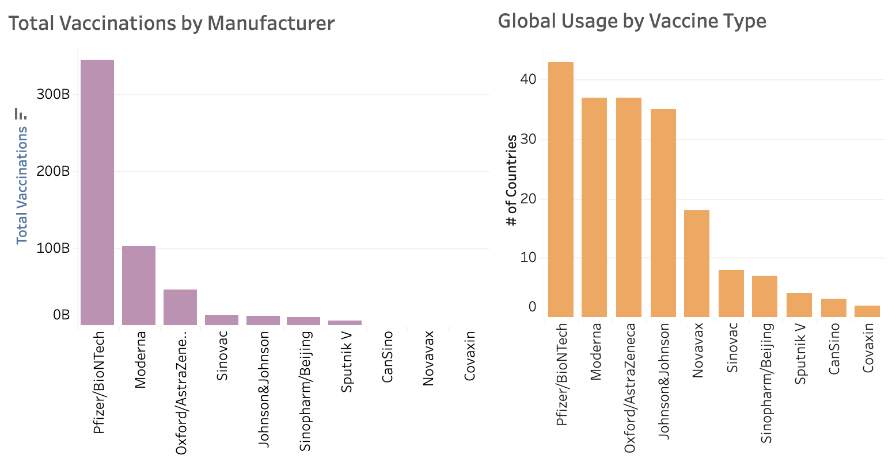

This project's goal is to explore global COVID-19 vaccination data and observe trends over time. The cleaned data was sourced from [Kaggle](https://www.kaggle.com/datasets/gpreda/covid-world-vaccination-progress).

## EDA Summary

### I. What percentage of the vaccinated population is fully vaccinated? 

Pitcairn, Qatar, and Tokelau have the highest percentage (100%), with their entire vaccinated population receiving full vaccination status. This may be the case for smaller countries like Pitcairn and Tokelau as the number of individuals who are vaccinated is already relatively low, therefore, it would require fewer resources (compared to a country with a larger population) and people vaccinated to receive 100% full vaccination status. On the other hand, Nigeria has the lowest % of fully vaccinated population relative to the entire vaccinated population with only ~45%. 

### II. Determining Total Population using % of people fully vaccinated and # of people fully vaccinated.

China and India have the largest total populations whereas Pitcairn and Tokelau have the smallest populations. This corroborates the findings from the first question as the countries with the highest % of fully vaccinated people also have the fewest people altogether. 

### III. Calculating the rolling sum of the % of the U.S. population that is fully vaccinated.

In December of 2020, the first vaccines were distributed in America and we see a low % of the population being fully vaccinated. This checks out as vaccines were in short supply and high demand. By May of 2021, this number jumps up to ~41% and gradually increasing over time. 

### IV. Which countries were the first/last to administer the first vaccination and what date did that occur?

Latvia was the first country to administer their COVID-19 vaccinations on December 4, 2020, with Denmark, Norway, the U.S., Canada, and Russia following not long after. Burundi administered their first vaccinations the latest date relative to other countries, occurring almost a year later on October 19, 2021. 

### V. Which vaccine type was the most popular overall and by country?

The most commonly administered vaccination is the Pfizer vaccine by a large margin, with Moderna coming in next at one-third of the volume of Pfizer vaccines. The least commonly used vaccine is Covaxin. 

The Pfizer, Moderna, and Johnson&Johnson vaccines were most commonly used in western countries such as the European Union and the U.S. while the other vaccines were used in South American countries (Chile, Argentina) and scattered across the E.U. as well. 

## Visualizations

All visuals are uploaded as PDFs and the interactive dashboard can be found [here](https://public.tableau.com/app/profile/samantha.chan2412/viz/COVID19_Visuals/Dashboard1?publish=yes)
